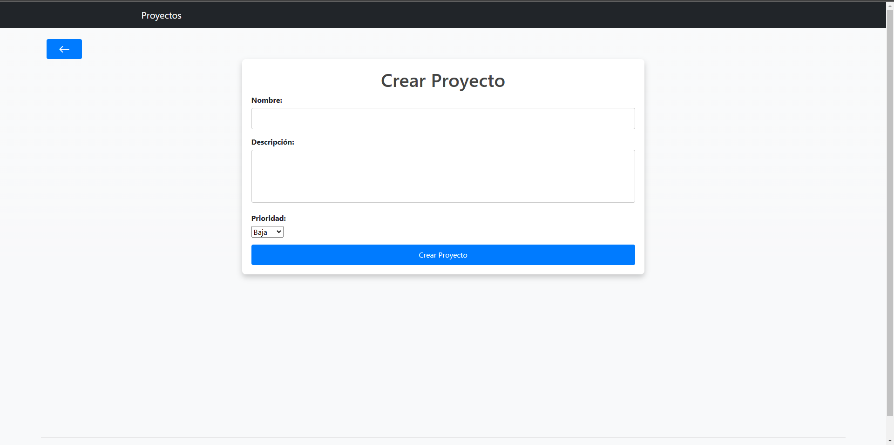
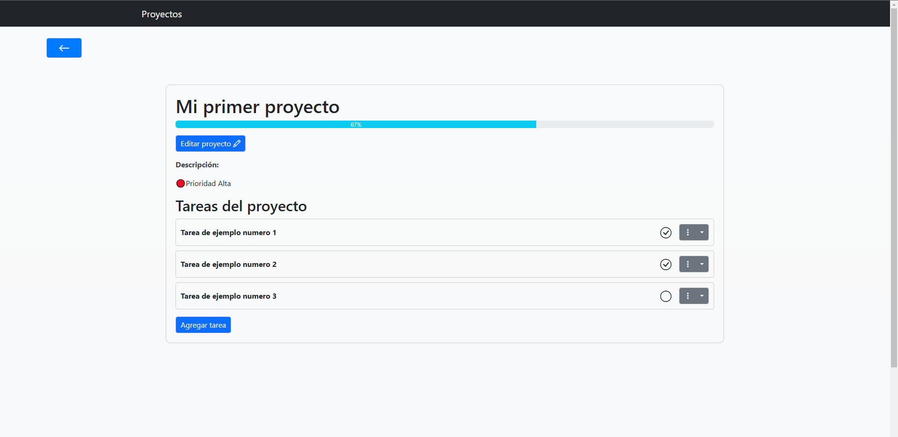

# Project Managment
The app is designed to track personal projects, where each of them can have one or more tasks associated.

[Click here for the Spanish version of this README](README-ES.md)

## Features
 - List of projects sorted by priority
 - List of projects with the percentage of completion for each project
 - Create a new project
 - Delete a project
 - Edit a project
 - Add task to a project
 - Tick a task as completed
 - Edit a task
 - Delete a task

## Main screen
The projects are displayed sorted by priority.
The percentage of completion for each project, its shown with their name

## Installation
1. Clone repository
    git clone https://github.com/Joaco-Femenia/Projects_Management

2. Create and activate a virtual environment
    Windows:
        python -m venv venv
        .\venv\Scripts\activate
    MacOS/Linux:
        python -m venv venv
        source venv/bin/activate

3. Install dependencies
    pip install -r requirements.txt

4. Set up the database
    python manage.py migrate

5. Execute the developement server
    python manage.py runserver

6. Open your browser and browse to `http://127.0.0.1:8000/`.

## Usage
1. When you enter the web app you will see a list of all projects or a message indicating that no projects are currently available, in the right corner there is a button with a '+', press it to create a new project. Each project on the list will be shown with its  progress bar, indicating the percentage of their tasks that have been completed, and a button to delete it.

2. In the tab for creating a new project, a name for the project, a description(optional), and a level of priority will be requested. Then you can confirm this new project by clicking "Crear Proyecto".

3. If you press the name of a project in the main list, you will see a detailed page of the project with their respective tasks, there providing the possibility to edit the project, add tasks, tick tasks as completed or delete them.

## Technologies
 - Python 3.12
 - Django
 - HTML
 - CSS
 - Bootstrap
 - JavaScript
 - Fetch

## Autor
 - Joaquin Femenia, GitHub: https://github.com/Joaquin-Femenia