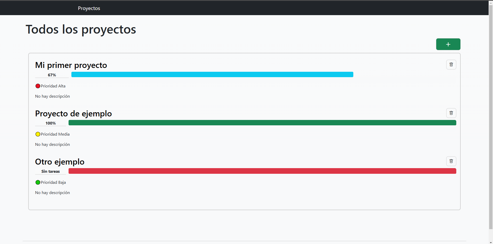
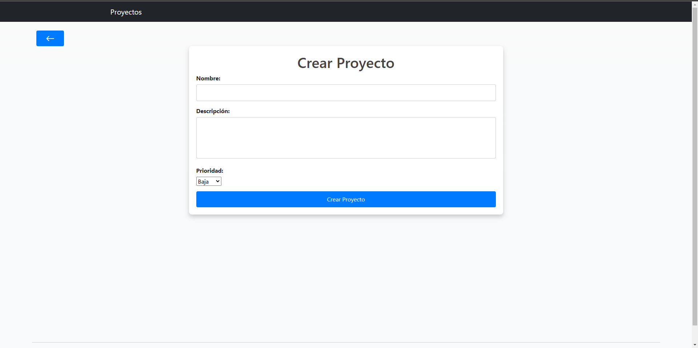
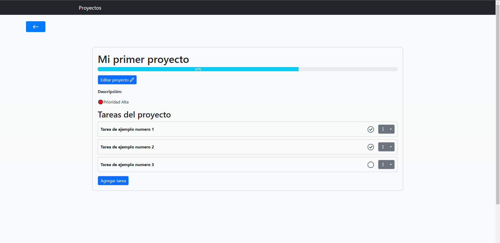

# Gestor de Proyectos
La aplicación está diseñada para gestionar proyectos personales, permitiendo que cada proyecto tenga una o más tareas asociadas.

[Haz clic aquí para la versión en inglés de este README](README-EN.md)

## Funcionalidades
 - Lista de proyectos ordenados por prioridad
 - Lista de proyectos con porcentaje de avance de completado de cada uno
 - Crear nuevo proyecto
 - Borrar proyecto
 - Editar proyecto
 - Agregar tarea a un proyecto
 - Marcar tarea como completada
 - Editar tarea
 - Eliminar tarea


## Vista Principal
Los proyectos se muestran ordenados por prioridad.
El porcentaje de avance de cada proyecto se muestra junto a su nombre


## Instalación
### 1. Clonar repositorio:
```sh
git clone https://github.com/Joaquin-Femenia/project-management
```
### 2 Entrar al directorio del projecto:
```sh
cd Projects_Management
```
### 3. Crear y activar entorno virtual:
Windows (CMD):
```sh
python -m venv venv
venv\Scripts\activate
```
Windows (PowerShell):
```sh
python -m venv venv
.\venv\Scripts\activate
```
Windows (Git Bash):
```sh
python -m venv venv
source venv/Scripts/activate
```
MacOS/Linux:
```sh
python -m venv venv
source venv/bin/activate
```
### 4. Instalar dependencias:
```sh
pip install -r requirements.txt
```
### 5. Entrar a la carpeta mysite:
```sh
cd mysite
```
### 6. Configurar la base de datos:
```sh
python manage.py migrate
```
### 7. Ejecutar el servidor de desarrollo:
```sh
python manage.py runserver
```
### 8. Abre tu navegador y accede a: `http://127.0.0.1:8000/`.


## Uso
1. Al acceder a la app podras ver la lista con todos los proyectos o un mensaje indicando si no hay ninguno creado, en la esquina superior derecha hay un botón con el símbolo '+'. Presiona para crear un nuevo proyecto. Cada proyecto en la lista se mostrara con una barra de progreso indicando que porcentaje de sus tareas han sido completadas, y un boton para eliminarlo.


2. En la pestaña de crear proyecto se solicitara un nombre para el proyecto, una descripción (opcional) y un nivel de prioridad para el proyecto. Luego podras confirmar este nuevo proyecto apretando "Crear Proyecto".


3. Si presionamos en el nombre del proyecto en la lista principal, podremos ver una página detallada del proyecto con sus respectivas tareas, pudiendo desde ahi, editar el proyecto, añadir tareas, marcar tareas como completadas o eliminarlas.



## Tecnologías
 - Python 3.12
 - Django
 - HTML
 - CSS
 - Bootstrap
 - JavaScript
 - Fetch


## Autor
 - Joaquin Femenia, GitHub: https://github.com/Joaquin-Femenia